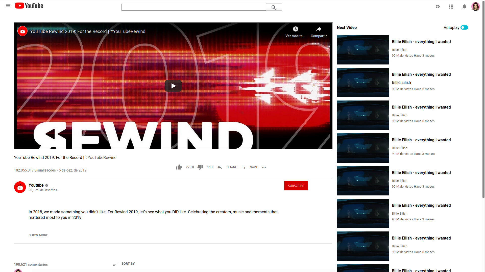

# Youtube Clone

> This project consists of building an HTML document that matches the appearance of youtube video player page.

## Built With

- HTML and CSS,

## Live Demo

[Live Demo Link](https://livedemo.com)

## Authors

👤 **Adrian Flores Pizarro**

- Github: [@githubhandle](https://github.com/AdfPizarro)
- Twitter: [@twitterhandle](https://twitter.com/adfpizarro)
- Linkedin: [linkedin](https://www.linkedin.com/in/adrian-flores-pizarro-73b62316a/)

👤 **Marilena Roque**

- Github: [@githubhandle](https://github.com/MarilenaRoque)
- Twitter: [@twitterhandle](https://twitter.com/MariRoq88285995)
- Linkedin: [linkedin](https://www.linkedin.com/in/roquemarilena/)

## 🤝 Contributing

Contributions, issues and feature requests are welcome!

Feel free to check the [issues page](issues/).

## Show your support

Give a ⭐️ if you like this project!

## 📝 License

This project is [MIT](lic.url) licensed.
